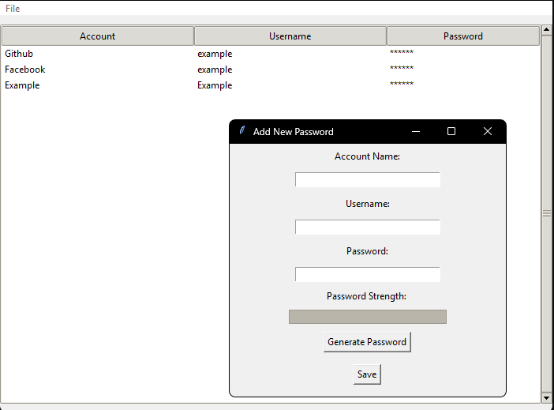

# Python Password Manager (PyPass)

A password manager built with **Python** and **tkinter** for a basic GUI. This project utilizes **Fernet encryption** from the cryptography library to securely store and manage your passwords locally. Honestly, just my first project that I dumped a bunch of stuff I learned from a python class. I am not a UI/UX designer.

## Screenshot

## Features

- **Secure Password Storage**: Passwords are encrypted using Fernet symmetric encryption.
- **Password Generation**: Generate strong, random passwords with a single click.
- **Password Strength Meter**: Dynamic strength indicator that evaluates password complexity in real time.
- **Click-to-Reveal**: Right-click to reveal or hide stored passwords.
- **Copy to Clipboard**: Right-click to copy account, username, or password securely.

### To-do:
- **Folders**
- **Grouping**
- **Tags**
- **UI Themes**
- **Masterkey access**
- **Edit/Delete existing entries**

### Main Functionalities:

1. **Add New Passwords**: 
   - Enter an account name and password, or use the **Generate Password** feature.
   - Click **Save Password** to securely store it.

2. **View & Manage Passwords**: 
   - Use the **Search** bar to filter accounts.
   - **Reveal** or **hide** passwords using the buttons.
   - **Double-click** on an entry to copy the password to your clipboard.

## Security Details

- **Encryption**: All passwords are encrypted using **Fernet symmetric encryption** from the `cryptography` library.
- **Key Management**: The encryption key is generated once and stored securely in a `key.key` file. This file is made read-only to prevent accidental overwriting.

## Contributing

Contributions are welcome! Feel free to submit pull requests or open issues to improve functionality or security.

## License

This project is licensed under the MIT License.

